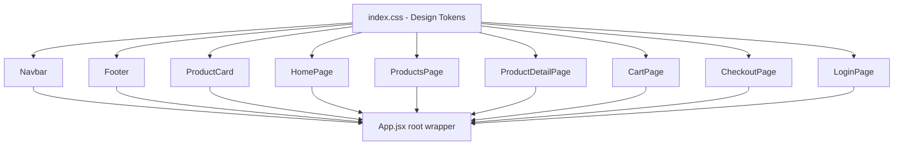
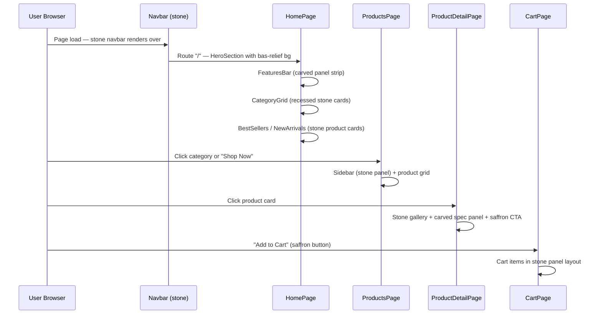

# Design Document: Rudraksha Website Redesign

## Overview

A complete UI/UX overhaul of the existing Rudraksha e-commerce site from a dark mahogany theme (`#1C0D05` background) to a minimalist, serene stone-temple aesthetic. The redesign preserves all current functionality (cart, wishlist, auth, admin, Supabase backend) while replacing every visual layer with a light cream-stone palette, inset carved panel effects, bas-relief SVG textures, and saffron-accented interactive elements that evoke a sacred physical space.

The guiding metaphor is a **hand-carved stone temple**: the page background is textured sandstone, content panels are recessed carvings, typography feels inscribed, and every interactive surface responds with a tactile press-down feel rather than bright glows.

The stack remains unchanged: React 19 + Vite, Tailwind CSS v4, Framer Motion, Zustand, Supabase, Lucide icons. No new dependencies are required — all effects are achieved with CSS custom properties, `box-shadow`, SVG `<pattern>` elements, and Tailwind utility classes.


---

## Architecture

The redesign is a **pure front-end theme change**. No backend, routing, or state management logic changes. All modifications target:

1. `src/index.css` — CSS custom properties (design tokens) and global body styles
2. `src/components/Navbar.jsx` — light stone navbar
3. `src/components/Footer.jsx` — dark saffron-accented footer (kept dark for contrast grounding)
4. `src/components/ProductCard.jsx` — stone-textured card with saffron CTA
5. `src/pages/HomePage.jsx` — hero section, category panels, features bar
6. `src/pages/ProductsPage.jsx` — sidebar, filter pills, product grid
7. `src/pages/ProductDetailPage.jsx` — product detail stone layout
8. `src/App.jsx` — root background token update only




---

## Visual Design System

### Color Palette

| Token | Hex | Usage |
|---|---|---|
| `--stone-bg` | `#EAE0D3` | Page background, main canvas |
| `--stone-panel` | `#F2EAE0` | Recessed carved panel surfaces |
| `--saffron` | `#FABE1A` | Primary CTA buttons, highlights |
| `--rudraksha-brown` | `#734129` | Headings, borders, icon color |
| `--body-text` | `#A67560` | Body copy, secondary text |
| `--dark-brown` | `#3D1A08` | Footer background, deep shadow |
| `--border-engraved` | `#C4A882` | Dividers, card borders |
| `--shadow-inset-light` | `rgba(255,255,255,0.7)` | Inner highlight on carved panels |
| `--shadow-inset-dark` | `rgba(115,65,41,0.25)` | Inner shadow depth on panels |

### Typography

| Element | Font | Color | Treatment |
|---|---|---|---|
| `h1`, `h2`, `h3` | Playfair Display / Cormorant Garamond / Georgia fallback | `#734129` | Elegant serif, slight letter-spacing |
| Body / nav labels | System sans / Inter | `#A67560` | Readable warm-toned body |
| Prices | Playfair Display bold | `#734129` | Currency emphasis |
| Category labels | Uppercase tracking-widest | `#A67560` | Muted engraved label feel |

### The "Stone Carving" Effect — CSS Recipe

Recessed panels simulate depth using a layered `box-shadow`:

```css
.stone-panel {
  background: #F2EAE0;
  box-shadow:
    inset 2px 2px 6px rgba(115, 65, 41, 0.20),   /* top-left inner shadow = depth */
    inset -1px -1px 4px rgba(255, 255, 255, 0.65); /* bottom-right inner light = rim */
  border: 1px solid #C4A882;
  border-radius: 12px;
}
```

Raised/proud surfaces (buttons, nav bar) use the inverse:

```css
.stone-raised {
  background: #EAE0D3;
  box-shadow:
    2px 2px 6px rgba(115, 65, 41, 0.25),   /* outer drop shadow = raised */
    -1px -1px 4px rgba(255, 255, 255, 0.8); /* top-left highlight = proud */
}
```


### Bas-Relief Background Texture

The main page canvas uses a repeating SVG pattern injected as a CSS `background-image` — a faint Banyan tree / sacred leaf motif at ~4% opacity so it reads as carved stone texture, not a visual distraction.

```css
body {
  background-color: #EAE0D3;
  background-image: url("data:image/svg+xml,%3Csvg xmlns='http://www.w3.org/2000/svg' width='120' height='120'%3E%3Cellipse cx='60' cy='60' rx='28' ry='44' fill='none' stroke='%23734129' stroke-width='0.6' opacity='0.12'/%3E%3Cellipse cx='60' cy='60' rx='14' ry='30' fill='none' stroke='%23734129' stroke-width='0.4' opacity='0.08'/%3E%3Cpath d='M60 16 Q68 36 60 52 Q52 36 60 16Z' fill='%23734129' opacity='0.04'/%3E%3C/svg%3E");
  background-size: 120px 120px;
}
```

A more detailed Banyan tree SVG (`/public/textures/banyan-tile.svg`) can be referenced for production; the inline data URI is the fallback.

---

## Architecture: Page-Level Sequence Flow




---

## Components and Interfaces

### Component 1: Design Token Layer (`src/index.css`)

**Purpose**: Single source of truth for all colors, shadows, and font stacks. Every component reads from CSS custom properties — one token change cascades everywhere.

**Interface** (CSS custom properties):

```css
:root {
  /* Palette */
  --stone-bg:        #EAE0D3;
  --stone-panel:     #F2EAE0;
  --saffron:         #FABE1A;
  --saffron-hover:   #E5AB00;
  --rudraksha-brown: #734129;
  --brown-dark:      #3D1A08;
  --body-text:       #A67560;
  --border-engraved: #C4A882;

  /* Shadows — carved panel (inset) */
  --shadow-panel: inset 2px 2px 6px rgba(115,65,41,0.20),
                  inset -1px -1px 4px rgba(255,255,255,0.65);

  /* Shadows — raised surface */
  --shadow-raised: 2px 2px 6px rgba(115,65,41,0.20),
                   -1px -1px 4px rgba(255,255,255,0.75);

  /* Shadows — saffron button press */
  --shadow-btn-pressed: inset 2px 2px 5px rgba(115,65,41,0.35),
                        inset -1px -1px 3px rgba(255,255,255,0.3);

  /* Typography */
  --font-heading: 'Playfair Display', 'Cormorant Garamond', 'Georgia', serif;
  --font-body:    'Inter', 'Segoe UI', system-ui, sans-serif;
}
```

**Responsibilities**:
- Define all design tokens used across every JSX component
- Set `body` background to `#EAE0D3` with bas-relief SVG pattern
- Define Tailwind utility class aliases for stone panel and raised surfaces

---

### Component 2: Navbar (`src/components/Navbar.jsx`)

**Purpose**: Top navigation bar redesigned as a proud stone slab sitting above the bas-relief canvas.

**Visual spec**:
- Background: `#EAE0D3` (matches page, feels monolithic)
- Bottom border: `1px solid #C4A882` with slight inset shadow
- Logo text: Playfair Display, `#734129`
- Nav links: `#A67560`, hover → `#734129` with saffron underline
- Search input: stone-panel inset style (`--shadow-panel`)
- Icons (cart, wishlist, user): `#734129` (aged brass tone)
- Cart badge: `#FABE1A` background, `#734129` text
- Login button: `#FABE1A` fill, `#734129` text, press-down hover

**Interface**:

```typescript
interface NavbarProps {
  // No props — reads from useAuthStore, useCartStore, useCategoryStore
}

// Key CSS classes applied:
// nav:          bg-[#EAE0D3] border-b border-[#C4A882] shadow-[var(--shadow-raised)]
// logo text:    font-[var(--font-heading)] text-[#734129]
// nav link:     text-[#A67560] hover:text-[#734129] hover:border-b-2 hover:border-[#FABE1A]
// search input: bg-[#F2EAE0] shadow-[var(--shadow-panel)] border border-[#C4A882]
// cart icon:    text-[#734129]
// login btn:    bg-[#FABE1A] text-[#734129] active:shadow-[var(--shadow-btn-pressed)]
```

**Responsibilities**:
- Render stone-toned top bar with logo, search, icons
- Desktop second row: centered nav links with saffron hover underline
- Mobile hamburger menu: slides open with stone panel background
- Search dropdown: stone-panel card with warm brown text


---

### Component 3: ProductCard (`src/components/ProductCard.jsx`)

**Purpose**: Grid and list product cards with warm stone-textured appearance and saffron CTA.

**Visual spec — GridCard**:
- Container: `bg-[#F2EAE0]` stone panel, `box-shadow: var(--shadow-panel)`, `border: 1px solid #C4A882`
- Image area: `bg-[#EAE0D3]` with slight inner shadow
- Category label: `#A67560` uppercase tracking-widest
- Product name: `#734129` Playfair Display, hover → `#FABE1A`
- Price: `#734129` bold
- "Add to Cart" button: `bg-[#FABE1A]` text-`#734129` font-bold, hover → slight inset shadow (press effect)
- Wishlist icon: `#734129`, active → red fill

**Interface**:

```typescript
interface ProductCardProps {
  product: Product;
  layout: 'grid' | 'list';
}

// Key visual changes from current dark theme:
// OLD: bg-[#2A1408] border-[#5C3015] text-white button-bg-[#C8860A]
// NEW: bg-[#F2EAE0] border-[#C4A882] text-[#734129] button-bg-[#FABE1A]

// Button press state CSS:
// .btn-saffron:active {
//   box-shadow: var(--shadow-btn-pressed);
//   transform: translateY(1px);
// }
```

**Responsibilities**:
- Render grid card with stone panel background
- Render list card with warm neutral layout
- Saffron "Add to Cart" button with tactile press animation
- Wishlist heart in brown/brass tone

---

### Component 4: HomePage (`src/pages/HomePage.jsx`)

**Purpose**: Landing page with hero, category grid, features strip, product sections — all in the stone temple aesthetic.

**Section breakdown**:

| Section | Background | Panel Style |
|---|---|---|
| HeroSection | `#EAE0D3` + bas-relief SVG overlay | Full-width, text over stone |
| FeaturesBar | `#F2EAE0` strip | Inset carved panel, 4 trust badges |
| CategoryGrid | `#EAE0D3` | Each category = recessed stone card |
| BestSellers / NewArrivals | `#F2EAE0` alternating | Product cards on panel background |
| ReviewsSection | `#EAE0D3` | Stone quote cards |

**HeroSection interface**:

```typescript
interface HeroSectionProps {
  heroVideoUrl: string | null;
  heroBgImageUrl: string | null;
}

// Hero overlay: instead of dark gradient, use a warm stone vignette:
// background: radial-gradient(ellipse at center,
//   rgba(234,224,211,0.15) 0%,
//   rgba(61,26,8,0.55) 100%)
//
// Hero h1: Playfair Display, #734129, text-shadow: 0 2px 12px rgba(61,26,8,0.6)
// CTA button: bg-[#FABE1A] text-[#734129] border-2 border-[#734129]
//             hover: scale-105 + shadow-[0_4px_20px_rgba(250,190,26,0.5)]
//             active: shadow-[var(--shadow-btn-pressed)] translateY(1px)
```

**Responsibilities**:
- Render hero with stone-warm overlay (not dark overlay)
- Display category cards as recessed stone panels
- Features bar as a carved horizontal strip
- Section titles use Playfair Display in `#734129`
- Dividers: `1px solid #C4A882` with inset shadow line


---

### Component 5: ProductsPage (`src/pages/ProductsPage.jsx`)

**Purpose**: Browse/filter page with sidebar and product grid — redesigned in stone aesthetic.

**Visual spec**:
- Page background: `#EAE0D3` with bas-relief texture
- Sidebar: `bg-[#F2EAE0]` stone panel with `var(--shadow-panel)`
- Sidebar header: `bg-[#734129]` (Rudraksha Brown) with cream text
- Active category: left border `3px solid #FABE1A`, text `#734129`
- Filter pills: `bg-[#F2EAE0]` border `#C4A882`, active `bg-[#734129]` text cream
- Sort dropdown: stone panel card
- Pagination buttons: stone-raised style, active `bg-[#734129]`

---

### Component 6: Footer (`src/components/Footer.jsx`)

**Purpose**: Site footer — kept dark for contrast grounding (dark mahogany anchors the light page above).

**Visual spec** (updated from current but stays dark):
- Background: `#3D1A08` (darker than current `#0F0501` — warmer)
- Border top: `2px solid #734129`
- Brand heading: `#FABE1A` (saffron instead of old amber `#C8860A`)
- Link hover: `#FABE1A`
- Contact icons: `#FABE1A`
- Footer divider: `border-[#734129]`

**Rationale**: A dark footer grounds the page visually. After scrolling through the light stone canvas, the dark footer signals "end of sacred space" — like the plinth of a temple.

---

## Data Models

### ThemeToken (CSS custom property map)

```typescript
interface ThemeTokens {
  stoneBg:         '#EAE0D3';
  stonePanel:      '#F2EAE0';
  saffron:         '#FABE1A';
  saffronHover:    '#E5AB00';
  rudrakshraBrown: '#734129';
  brownDark:       '#3D1A08';
  bodyText:        '#A67560';
  borderEngraved:  '#C4A882';
}
```

### BasReliefPattern

```typescript
interface BasReliefPatternConfig {
  svgUrl: string;          // inline data URI or /public/textures/banyan-tile.svg
  tileSize: '120px 120px'; // CSS background-size
  opacity: 0.04 | 0.06;   // overlay opacity — kept very low
  blendMode: 'multiply';   // CSS mix-blend-mode for depth
}
```

### StonePanelVariant

```typescript
type StonePanelVariant = 'recessed' | 'raised' | 'flat';

interface StonePanelStyle {
  variant: StonePanelVariant;
  background: string;   // #F2EAE0 for recessed, #EAE0D3 for raised
  boxShadow: string;    // var(--shadow-panel) or var(--shadow-raised)
  border: string;       // 1px solid #C4A882
  borderRadius: string; // 8px | 12px | 16px
}
```


---

## Algorithmic Pseudocode

### Algorithm 1: Theme Token Migration

This describes the systematic process for replacing dark-theme color constants with stone-theme tokens across all files.

```pascal
ALGORITHM migrateThemeTokens(fileList)
  INPUT: fileList — array of JSX/CSS file paths
  OUTPUT: updatedFiles — array of modified file paths

  BEGIN
    colorMap ← buildColorMap()
    /* colorMap maps each dark token to its stone replacement */

    FOR EACH file IN fileList DO
      content ← readFile(file)
      modified ← false

      FOR EACH [oldColor, newColor] IN colorMap DO
        IF content CONTAINS oldColor THEN
          content ← replaceAll(content, oldColor, newColor)
          modified ← true
        END IF
      END FOR

      IF modified THEN
        writeFile(file, content)
        updatedFiles.push(file)
      END IF
    END FOR

    RETURN updatedFiles
  END

PROCEDURE buildColorMap()
  /* Maps every dark-theme hex constant to its stone-theme equivalent */
  RETURN {
    '#1C0D05' → '#EAE0D3',   /* page bg: near-black → sandstone */
    '#2A1408' → '#F2EAE0',   /* surface: dark mahogany → carved panel */
    '#3D1F0A' → '#F2EAE0',   /* surface-2 → same panel */
    '#1A0A02' → '#EAE0D3',   /* deep bg → base stone */
    '#C8860A' → '#FABE1A',   /* amber accent → saffron */
    '#E5A020' → '#FABE1A',   /* amber-light → saffron */
    '#5C3015' → '#C4A882',   /* border-brown → engraved border */
    '#DDB87A' → '#A67560',   /* text-mid → body text */
    '#F5E6C8' → '#734129',   /* text-dark (light cream) → rudraksha brown */
    '#5D3A1A' → '#734129',   /* admin brown → unified brown */
    'text-white' → 'text-[#734129]',   /* white text → brown text */
    'bg-[#1C0D05]' → 'bg-[#EAE0D3]',  /* root bg class */
  }
END PROCEDURE
```

**Preconditions:**
- All color constants appear as string literals in JSX className props or CSS values
- No colors are computed dynamically at runtime (they are all static hex values)

**Postconditions:**
- Every dark-theme hex value is replaced with its stone-theme counterpart
- Visual output matches the stone temple aesthetic
- No functionality is altered — only visual classes change


### Algorithm 2: Stone Panel Class Composition

Describes how the stone panel utility class is applied consistently across components.

```pascal
ALGORITHM applyStonePanel(element, variant)
  INPUT:  element — JSX element reference
          variant — StonePanelVariant ('recessed' | 'raised' | 'flat')
  OUTPUT: element with correct stone panel className

  BEGIN
    baseClasses ← 'border border-[#C4A882] rounded-xl'

    IF variant = 'recessed' THEN
      panelClasses ← 'bg-[#F2EAE0] shadow-[inset_2px_2px_6px_rgba(115,65,41,0.20),inset_-1px_-1px_4px_rgba(255,255,255,0.65)]'
    ELSE IF variant = 'raised' THEN
      panelClasses ← 'bg-[#EAE0D3] shadow-[2px_2px_6px_rgba(115,65,41,0.20),-1px_-1px_4px_rgba(255,255,255,0.75)]'
    ELSE
      panelClasses ← 'bg-[#F2EAE0]'
    END IF

    element.className ← baseClasses + ' ' + panelClasses
    RETURN element
  END
```

### Algorithm 3: Saffron Button Hover/Press States

```pascal
ALGORITHM safronButtonInteraction(button)
  INPUT:  button — CTA button element
  OUTPUT: button with tactile hover + press states

  BEGIN
    /* Default state */
    button.style ← 'bg-[#FABE1A] text-[#734129] font-bold border-2 border-[#734129]'

    ON hover DO
      button.style.transform ← 'translateY(-1px)'
      button.style.boxShadow ← '0 6px 20px rgba(250,190,26,0.45)'
      /* Slight lift — still stone-physical, not glow */
    END ON

    ON active (press) DO
      button.style.transform ← 'translateY(1px)'
      button.style.boxShadow ← 'inset 2px 2px 5px rgba(115,65,41,0.35), inset -1px -1px 3px rgba(255,255,255,0.3)'
      /* Inset shadow = physical depression into stone */
    END ON

    RETURN button
  END
```

**Preconditions:**
- Button element exists in DOM
- Framer Motion `whileHover` and `whileTap` props are used for the animation

**Postconditions:**
- Hover: button lifts slightly (not flat)
- Press/active: button depresses inward (tactile carved feel)
- Released: returns to default with smooth transition

**Loop Invariants:** N/A (event-driven, not iterative)


---

## Key Functions with Formal Specifications

### Function 1: `getStonePanelClasses(variant)`

```typescript
function getStonePanelClasses(variant: 'recessed' | 'raised' | 'flat'): string
```

**Preconditions:**
- `variant` is one of the three enum values
- Tailwind CSS v4 is loaded and `[]` arbitrary values are supported

**Postconditions:**
- Returns a non-empty string of space-separated Tailwind class names
- The returned string contains `bg-[#F2EAE0]` for `recessed` variant
- The returned string contains `bg-[#EAE0D3]` for `raised` variant
- The returned string always includes `border border-[#C4A882]`
- No side effects

**Loop Invariants:** N/A

---

### Function 2: `buildBasReliefDataUri()`

```typescript
function buildBasReliefDataUri(): string
```

**Preconditions:**
- Called during CSS generation or as a `style` prop value
- No browser APIs needed — pure string construction

**Postconditions:**
- Returns a valid `url("data:image/svg+xml,...")` string
- The SVG encodes a Banyan tree / sacred leaf motif
- All special characters (`<`, `>`, `#`, `%`) are URL-encoded
- Tile is square (120×120px) and seamlessly tileable
- Stroke opacity ≤ 0.12 (non-distracting)

---

### Function 3: `applyThemeToRoot()`

```typescript
function applyThemeToRoot(): void
// Called once from index.css @layer base
```

**Preconditions:**
- `:root` selector is available (browser environment)
- CSS custom properties spec is supported

**Postconditions:**
- All `--stone-*`, `--saffron`, `--rudraksha-brown` tokens are defined on `:root`
- `body` background-color equals `#EAE0D3`
- `body` background-image is the bas-relief SVG tile
- `body` color equals `#734129` (default text)
- Font family stack includes Playfair Display as first heading font
- Scrollbar track: `#EAE0D3`, thumb: `#734129`, hover: `#FABE1A`


---

## Example Usage

### 1. Stone Panel Component Composition

```jsx
// Recessed carved panel — used for product cards, category tiles, features bar
<div className="
  bg-[#F2EAE0]
  border border-[#C4A882]
  rounded-xl
  shadow-[inset_2px_2px_6px_rgba(115,65,41,0.20),inset_-1px_-1px_4px_rgba(255,255,255,0.65)]
  p-5
">
  <h3 style={{ fontFamily: 'Playfair Display, Georgia, serif', color: '#734129' }}>
    1 Mukhi Rudraksha
  </h3>
  <p style={{ color: '#A67560' }}>Single-faced bead of supreme spiritual power</p>
</div>
```

### 2. Saffron CTA Button with Tactile Press

```jsx
import { motion } from 'framer-motion'

// Primary "Add to Cart" / "Shop Now" button
<motion.button
  whileHover={{ y: -1, boxShadow: '0 6px 20px rgba(250,190,26,0.45)' }}
  whileTap={{
    y: 1,
    boxShadow: 'inset 2px 2px 5px rgba(115,65,41,0.35), inset -1px -1px 3px rgba(255,255,255,0.3)'
  }}
  className="
    bg-[#FABE1A] text-[#734129] font-bold
    border-2 border-[#734129]
    px-6 py-2.5 rounded-lg
    tracking-wide uppercase text-sm
    transition-all duration-150
  "
>
  Add to Cart
</motion.button>
```

### 3. Updated Navbar Top Row

```jsx
// Stone navbar — replaces dark #1A0A02 with #EAE0D3
<nav className="
  sticky top-0 z-50 w-full
  bg-[#EAE0D3]
  border-b border-[#C4A882]
  shadow-[0_2px_8px_rgba(115,65,41,0.15)]
">
  {/* Logo */}
  <span style={{ fontFamily: 'Playfair Display, Georgia, serif', color: '#734129' }}>
    RUDRAKSHA DIVINE
  </span>

  {/* Search input — recessed carved well */}
  <input className="
    bg-[#F2EAE0]
    border border-[#C4A882]
    rounded-full
    shadow-[inset_1px_1px_4px_rgba(115,65,41,0.15)]
    placeholder-[#A67560]
    text-[#734129]
    focus:border-[#734129]
  " />

  {/* Cart icon */}
  <ShoppingCart className="text-[#734129] hover:text-[#FABE1A]" />
</nav>
```

### 4. Category Card (Recessed Stone Tile)

```jsx
// Category grid card — "carved into the stone wall"
<Link className="
  group
  bg-[#F2EAE0]
  border border-[#C4A882]
  rounded-xl overflow-hidden
  shadow-[inset_2px_2px_6px_rgba(115,65,41,0.18),inset_-1px_-1px_4px_rgba(255,255,255,0.60)]
  hover:shadow-[inset_3px_3px_8px_rgba(115,65,41,0.28),inset_-2px_-2px_5px_rgba(255,255,255,0.70)]
  transition-all duration-300
">
  
  <div className="px-3 py-3">
    <h3 style={{ fontFamily: 'Playfair Display, serif', color: '#734129' }}>1–14 Mukhi</h3>
    <p style={{ color: '#A67560', fontSize: '11px' }}>Single beads, specific benefits</p>
    <span className="mt-2 inline-block text-[10px] font-bold text-[#734129] border border-[#734129] px-3 py-1 rounded
                     group-hover:bg-[#FABE1A] group-hover:border-[#FABE1A] transition-all">
      EXPLORE
    </span>
  </div>
</Link>
```


---

## Correctness Properties

The following properties must hold after the redesign is applied:

1. **Color coverage**: For every component file in `src/`, no instance of the old dark-theme hex values (`#1C0D05`, `#2A1408`, `#3D1F0A`, `#1A0A02`, `#0F0501`) appears as a Tailwind class or inline style in the storefront layout components (Navbar, Footer, ProductCard, HomePage, ProductsPage, ProductDetailPage, CartPage).

2. **Saffron CTA consistency**: Every primary action button (Add to Cart, Shop Now, Login, Checkout) uses `bg-[#FABE1A]` and `text-[#734129]`. No primary button uses the old amber `#C8860A` or `#E5A020`.

3. **Heading typography**: Every `<h1>`, `<h2>`, and `<h3>` in storefront pages (excluding admin panel) uses `font-family` that includes `Playfair Display` or `Georgia` and `color: #734129`.

4. **Stone panel depth**: Every content block that displays as a "panel" (product cards, category tiles, sidebar, features bar) has an `inset` box-shadow that creates visual depth — no flat white cards.

5. **Admin isolation**: The admin panel (`/admin/**` routes and `src/pages/admin/**`, `src/components/admin/**`) retains its current white/gray theme. No admin component receives the stone-theme tokens.

6. **Accessibility contrast**: The combination of `#734129` text on `#EAE0D3` background meets WCAG AA contrast ratio ≥ 4.5:1. The combination of `#734129` on `#FABE1A` (button text) meets WCAG AA ≥ 4.5:1.

7. **Bas-relief subtlety**: The SVG background tile overlay has opacity ≤ 0.12 at any point. No element of the bas-relief pattern obscures text or product images.

8. **Functional preservation**: All interactive behaviors (add to cart, wishlist toggle, search suggestions, category filter, pagination, auth flow) work identically after the redesign. No state management, routing, or Supabase query code is modified.

9. **Scrollbar theming**: The custom scrollbar thumb color is `#734129`, track is `#EAE0D3`, and hover state is `#FABE1A` — consistent with the stone palette.

10. **Mobile responsiveness**: On viewports < 768px, the stone panel inset shadows remain visible and correctly oriented. The mobile nav menu background is `#EAE0D3` (not the old `#1A0A02`).


---

## Error Handling

### Error Scenario 1: Missing Font — Playfair Display fails to load

**Condition**: User's browser cannot fetch Google Fonts or CDN is down  
**Response**: The CSS font stack falls back to:
```css
font-family: 'Playfair Display', 'Cormorant Garamond', 'Georgia', serif;
```
Georgia (system serif) serves as graceful degradation — the design retains serif elegance.

**Recovery**: Display warning in browser console if `document.fonts` API detects failure. No UX disruption — user sees Georgia headings.

---

### Error Scenario 2: Tailwind v4 CSS Layer Not Applied

**Condition**: CSS custom properties are not loaded (build config error)  
**Response**: Browser attempts to render with default user-agent styles. All `bg-[#EAE0D3]` classes are ignored → no color applied.  
**Recovery**: Display a root-level error boundary message: "Theme failed to load. Please refresh or contact support."  
**Prevention**: Add a build-time CSS validation step that asserts `:root { --stone-bg: ... }` exists in compiled output.

---

### Error Scenario 3: SVG Bas-Relief Pattern Fails to Render

**Condition**: Malformed `data:image/svg+xml` URI or browser SVG support disabled  
**Response**: The page background renders as a flat `#EAE0D3` color — no texture overlay appears.  
**Recovery**: Acceptable degradation — the flat sandstone background is the fallback. The aesthetic remains stone-like but less tactile.  
**Prevention**: Serve the SVG pattern as a static `/public/textures/banyan-tile.svg` file with a `<link rel="preload">` in index.html, then reference it in CSS:
```css
background-image: url('/textures/banyan-tile.svg');
```
If the file 404s, the rule fails silently and the solid background color remains.

---

### Error Scenario 4: User Disables Custom Fonts (Privacy Mode)

**Condition**: `font-display: swap` or `font-display: optional` causes FOIT (flash of invisible text) on slow connections  
**Response**: Use `font-display: swap` so the fallback font renders immediately.  
**Recovery**: Playfair Display loads asynchronously, then text re-renders in the custom font. No blocking or blank state.


---

## Testing Strategy

### Unit Testing Approach

Each restyled component will have a visual smoke test asserting:
- The root element contains the correct background color class
- No old dark-theme hex values appear in rendered class lists
- Primary CTA buttons contain `bg-[#FABE1A]`
- Heading elements use the serif font family

```typescript
// Example unit test (Vitest + @testing-library/react)
test('ProductCard uses stone panel background', () => {
  const { container } = render(<ProductCard product={mockProduct} layout="grid" />)
  const card = container.firstChild as HTMLElement
  expect(card.className).toContain('#F2EAE0')
  expect(card.className).not.toContain('#2A1408') // no old dark surface
})

test('Add to Cart button is saffron', () => {
  render(<ProductCard product={mockProduct} layout="grid" />)
  const btn = screen.getByText(/Add to Cart/i)
  expect(btn.className).toContain('#FABE1A')
  expect(btn.className).toContain('#734129')
})
```

### Property-Based Testing Approach

**Property Test Library**: fast-check

Properties to verify via generative testing:

1. **Stone panel shadow validity**: For any component using `getStonePanelClasses(variant)`, the returned string always contains valid CSS `box-shadow` syntax with `inset` keyword for `recessed` variant.

2. **Color contrast invariant**: For any `(textColor, bgColor)` pair drawn from the design token set, the WCAG contrast ratio is ≥ 4.5:1 for body text and ≥ 3:1 for large headings.

3. **Button state consistency**: For any button rendered with `layout = 'grid' | 'list'`, the CTA button background is always `#FABE1A` regardless of stock status, wishlist status, or cart status.

```typescript
import * as fc from 'fast-check'

test('stone panel classes always contain inset shadow for recessed', () => {
  fc.assert(
    fc.property(
      fc.constantFrom('recessed' as const, 'raised' as const, 'flat' as const),
      (variant) => {
        const classes = getStonePanelClasses(variant)
        if (variant === 'recessed') {
          return classes.includes('inset')
        }
        return typeof classes === 'string' && classes.length > 0
      }
    )
  )
})
```

### Integration Testing Approach

- Run `npm run build` and confirm 0 errors — Tailwind v4 should resolve all arbitrary `[]` class values
- Visual regression using Playwright screenshots: capture homepage, products page, product detail, cart, login at 1440px and 375px — compare against baseline screenshots taken after initial redesign
- Contrast checker: automated script using `wcag-contrast` npm package runs against all `(text, bg)` token pairs

